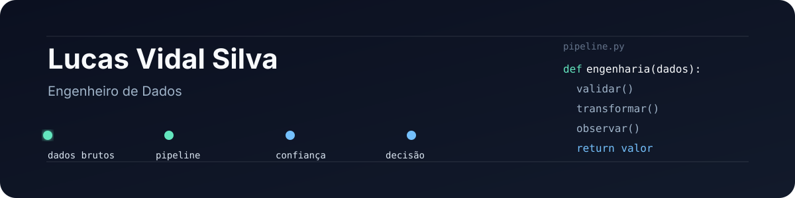

 

### Engenheiro de Dados

Transformo dados dispersos em **pipelines confiáveis** e **produtos de dados úteis para decisão**.

[LinkedIn](https://www.linkedin.com/in/lucasvidalsilvah) · [Projetos](#projetos-em-destaque)

---

## Projetos em destaque

<table>
<tr>
<td width="50%" valign="top">

### [CredLake](https://github.com/lucasvidalsilva/credito-analytics-databricks)

Lakehouse para análise de carteira de crédito.

**Mostra:** ingestão batch e incremental, Medallion, qualidade, quarentena, reconciliação financeira, camada Gold, observabilidade e orquestração.

`Databricks` `PySpark` `Delta Lake` `Auto Loader` `Lakeflow`

</td>
<td width="50%" valign="top">

### [CDC Real-Time](https://github.com/lucasvidalsilva/cdc-realtime)

Pipeline de Change Data Capture a partir do WAL do PostgreSQL.

**Mostra:** captura de `INSERT`, `UPDATE` e `DELETE` sem recarregar a tabela inteira.

`PostgreSQL` `Debezium` `Kafka` `Python`

</td>
</tr>

<tr>
<td width="50%" valign="top">

### [Data Quality](https://github.com/lucasvidalsilva/data-quality)

Pipeline defensivo com contratos de dados e validação automática.

**Mostra:** dado ruim é bloqueado antes de chegar à camada analítica.

`Great Expectations` `dbt` `DuckDB` `Testing`

</td>
<td width="50%" valign="top">

### [Lakehouse Local](https://github.com/lucasvidalsilva/lakehouse-local)

Lakehouse local usando formatos abertos.

**Mostra:** time travel, schema evolution e consultas analíticas sem depender de um warehouse proprietário.

`Iceberg` `MinIO` `DuckDB` `Parquet`

</td>
</tr>
</table>

---

 

**construir sistemas · entender princípios · gerar valor**

